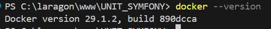
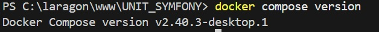
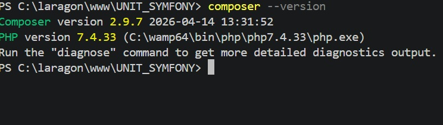
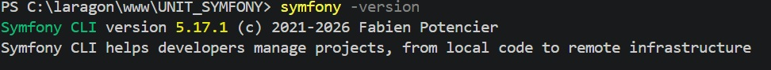

# UNIT_SYMFONY

## Vérification de Docker
Commande utilisée :
```bash
docker -version
```
Résultat :



## Vérification de Docker Compose
Commande utilisée :
```bash
docker compose version
```
Résultat :


## Vérification de Composer
Commande utilisée :
```bash
composer -version
```
Résultat :


## Vérification de Symfony CLI
Commande utilisée :
```bash
symfony -version
```
Résultat :
